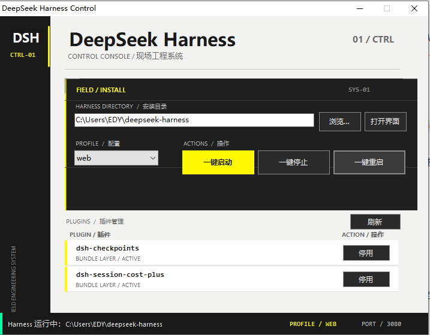

# DeepSeek Harness 控制台

一个 Windows 小工具，用于一键启动 / 停止 / 重启 DeepSeek Harness。

## 功能

- 自动检测 DeepSeek Harness 安装目录
  - 默认常见位置：`%USERPROFILE%\deepseek-harness`、`%USERPROFILE%\source\repos\deepseek-harness` 等
  - 自动扫描所有固定磁盘的常见目录（`dev`、`projects`、`source`、`tools`、`workspace`、`code`、`repos`）
  - 支持 `DSH_HOME` 环境变量和正在运行的 Harness 进程路径
- 一键启动：打开新命令行窗口运行 `node --import tsx/esm apps/cli/src/bin.ts <profile>`
- Profile 选择：支持 `web` / `desktop`
- 一键打开 Web UI：读取 `DSH_WEB_URL`，默认 `http://127.0.0.1:3080`
- 一键停止：自动结束 Harness 相关 Node / CMD 进程
- 一键重启：先停止再启动
- 实时状态监控：每 2 秒自动检测 Harness 是否在运行
- 最小化到系统托盘：关闭窗口后驻留托盘，可随时从托盘菜单操作
- 插件管理：列出当前 profile 的外部插件，勾选一键启用、取消勾选一键停用（写入 `dsh.profile.bundles`）
- Endfield complex 风格界面：炭黑侧栏 + 深色工程面板 + 信号黄操作区 + 底部仪表状态栏

## 界面展示



## 使用

直接运行 `bin/DeepSeekHarnessControl.exe`，或双击桌面快捷方式。

## 从源码构建

```powershell
.\build.ps1
```

构建依赖 Windows 自带的 .NET Framework C# 编译器：

```text
C:\Windows\Microsoft.NET\Framework64\v4.0.30319\csc.exe
```

输出到 `bin\DeepSeekHarnessControl.exe`。

## 目录

```text
├── bin/
│   └── DeepSeekHarnessControl.exe   # 预编译好的控制台程序
├── harness-app/
│   └── Program.cs                    # C# 源码
├── build.ps1                         # 一键重新编译脚本
├── 界面展示.png                       # 界面截图
└── README.md
```
